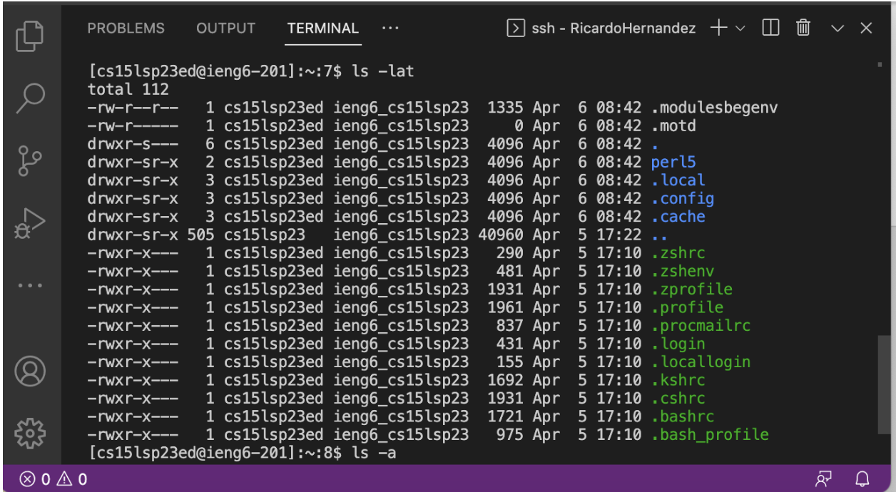

How To Log Into Course Specific Account CSE 15L

Step 1:

In order to start remote access you need to download vscode. If you have already downloaded it then you can move on to the next step. If you need to download it then go to this link and follow the instructions [https://code.visualstudio.com/](https://code.visualstudio.com/).

Step 2:

Now we have to find our course specific code for the next step. In order to find this click the following link: [https://sdacs.ucsd.edu/~icc/index.php](https://sdacs.ucsd.edu/~icc/index.php) In order to reset your password follow these instructions:  [[TUTORIAL] How to Reset your CSE 15L Password](https://drive.google.com/file/d/17IDZn8Qq7Q0RkYMxdiIR0o6HJ3B5YqSW/view) Next we must open a terminal. Once on the screen hit control + ` or hit terminal then new terminal in the menu of VS code. Now copy paste the following code but replace zz with your personal code. ''' ssh cs15lsp23zz@ieng6.ucsd.edu ''' This should now initiate the remote connection.

Step 3:

Now that you have remotely connected you can try out different commands. Simply type them into the terminal and then hit enter. Some examples of commands are ''' cd~ ''' ''' cd ''' ''' ls -lat ''' ''' ls -a '''

