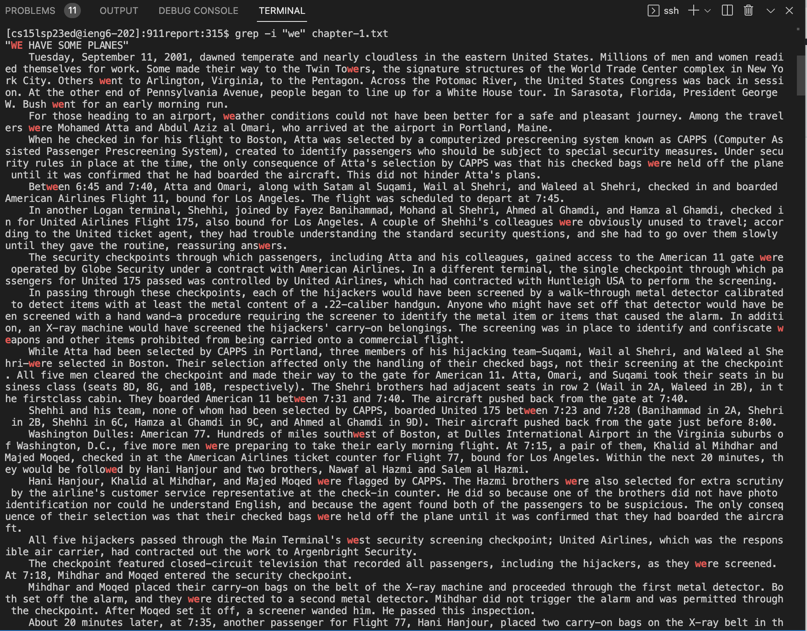
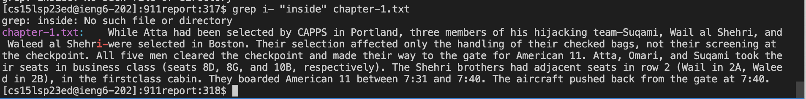
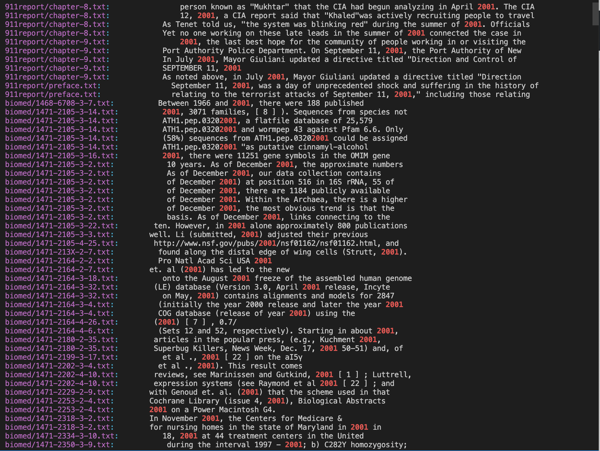

```
grep -i "we" chapter-1.txt
```


```
grep -i "inside" chapter-1.txt
```


This command looks for the string but ignores any of the casing. This is useful if you are not sure whether a word is uppercase or lowercase.

```
grep -r "2001"
```

```
grep -r "American"
```

This command looks for the strings in all the files and subdirectories. This is useful to look for things in multiple files and directories at once.

```
grep -v "The" stringsearch-data/technical/911report/chapter-1.txt
```
```
grep -v "All" stringsearch-data/technical/911report/chapter-1.txt
'''
This command looks for all the lines in the file that do not contain the string. This is useful in order to filter out lines.

'''
grep -w "Washington" stringsearch-data/technical/911report/chapter-1.txt
```
```
grep -w "Shehhi" stringsearch-data/technical/911report/chapter-1.txt
```
This command looks for the whole word that is given. This is useufl to filter out false positives and only get what you want.


This was all found by using ChatGPT.
I typed in:
Consider the commands less, find, and grep in java. Choose one of them. Online, find 4 interesting command-line options or alternate ways to use the command you chose. For example, we saw the -name option for find in class. For each of those options, give 2 examples of using it on files and directories from ./technical. Show each example as a code block that shows the command and its output, and write a sentence or two about what it’s doing and why it’s useful.

It then returned the following:
As a language model, I don't have access to the command line interface or terminal, as I run on servers. However, I can provide you with information about the commands you mentioned and some examples of how they can be used.

grep is a command-line utility in Unix/Linux that searches for patterns in files. It is a powerful tool for searching text files for specific strings, regular expressions, or patterns. Here are four interesting options for using the grep command:

-r or --recursive: This option tells grep to search for a pattern recursively in all files under a directory. This is useful when you want to search for a pattern in a large directory with multiple levels of subdirectories.
Example: Search for the word "technical" in all files under the directory ./technical recursively.

bash
Copy code
grep -r "technical" ./technical
-n or --line-number: This option tells grep to display the line numbers for each matched line in the file. This can be useful when you want to know the line number where a specific pattern is found.
Example: Search for the word "Java" in the file file1.txt and display the line number for each matched line.

bash
Copy code
grep -n "Java" file1.txt
-i or --ignore-case: This option tells grep to ignore case sensitivity while searching for a pattern. This can be useful when you want to search for a pattern regardless of the case of the letters in the pattern.
Example: Search for the word "Java" in the file file1.txt while ignoring the case of the letters.

bash
Copy code
grep -i "java" file1.txt
-v or --invert-match: This option tells grep to display all lines that do not match the pattern. This can be useful when you want to exclude lines that contain a certain pattern.
Example: Search for all lines in the file file1.txt that do not contain the word "Java".
