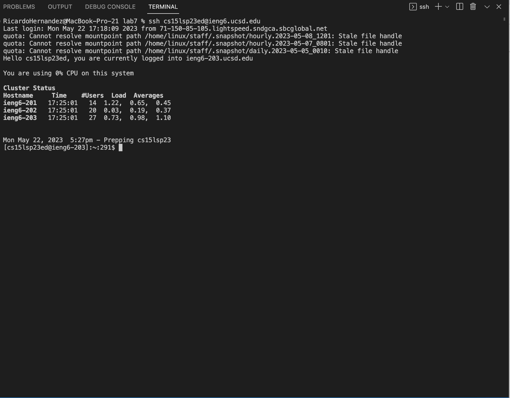
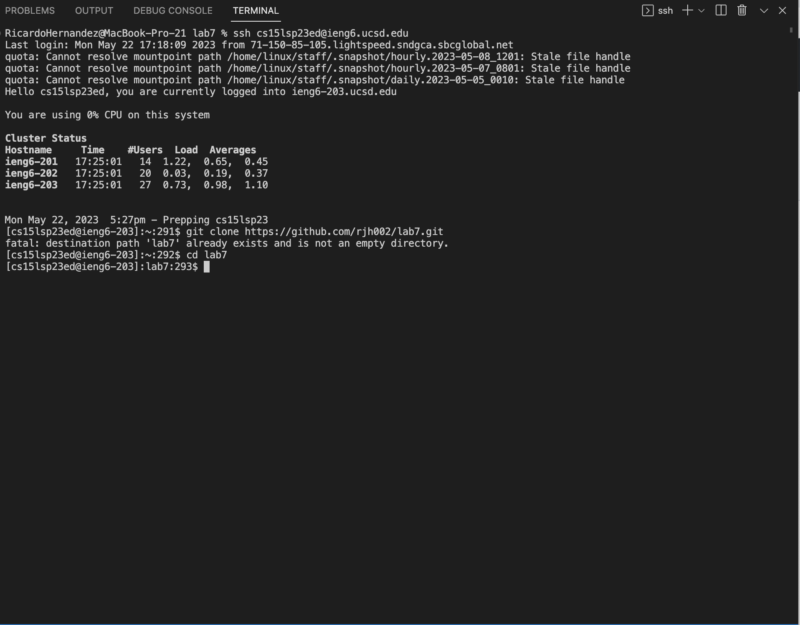
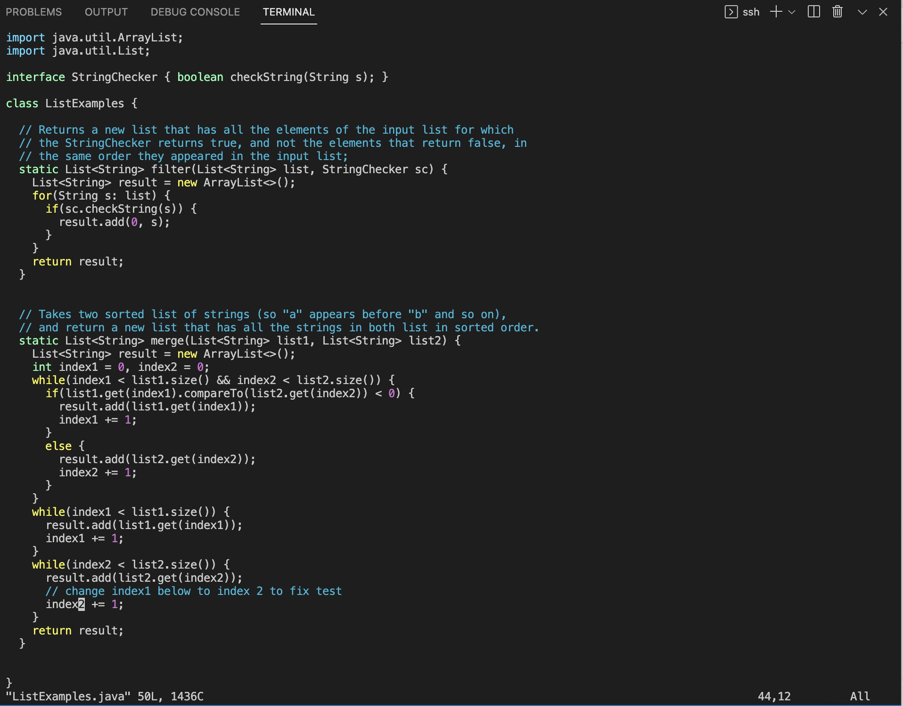
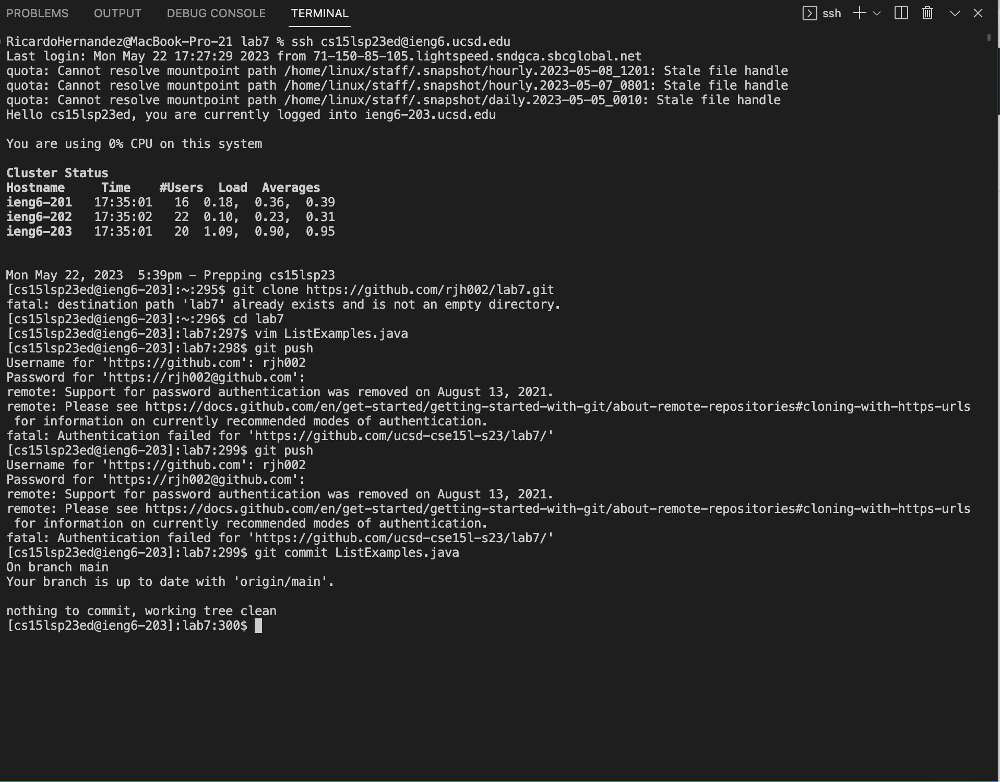

Step 1: Log into ieng6

To do this I typed in the command 
'''
ssh cs15lsp23ed@ieng6.ucsd.edu
'''
Then I hit 
'''
<Enter>
'''

Step 2: Clone fork of repository

To do this I typed the command
'''
git clone https://github.com/rjh002/lab7.git
'''
  
Step 3: Edit the code to fix the failing test

First I typed the command
'''
vim ListExamples.java
'''
Then I hit 
'''
<J>
'''
unitl I was on the right line.

Then I hit
'''
<L>
'''
until I was hovering over the right character.
  
Then I hit 
'''
<x>
'''

Then I hit
'''
<i>
'''

Then I clicked 2.
  
Then to save I clicked
'''
:wq <Enter>
'''

Step 4: Commit and push git

  
Then I did
'''
git commit ListExamples.java
'''
in order to save it all.
  
