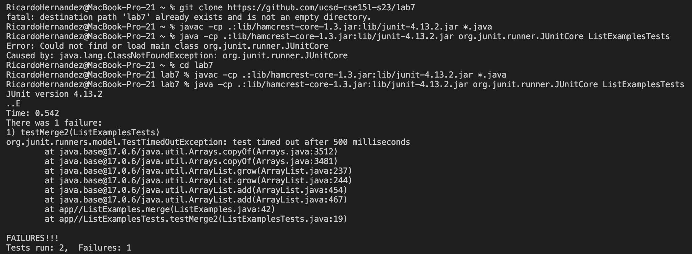
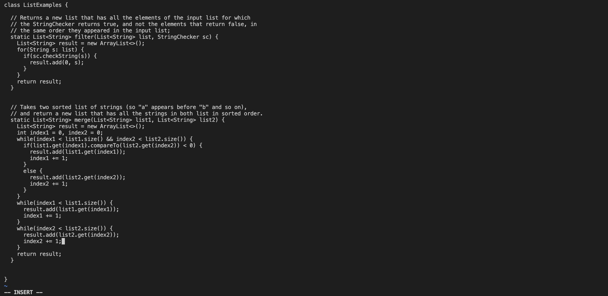
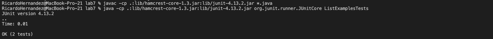

Student: I'm using visual studio code terminal on my laptop.
I expected for both tests to run and pass. It should end with one list that is completely sorted. After inputting the commands the test out this program there are problems. I'm not sure why the test is timing out.

TA: Use vim in order to go into your code and find any descrpenacies or things that would cause problems.

Student: 



I went in and noticed that I accidentally wrote index1 when I met to write index2. So I navigated to it using ```hjkl``` and then I hit ```i``` and delted the 1 and put 2.

Now when I run the command to test it all the tests pass.



